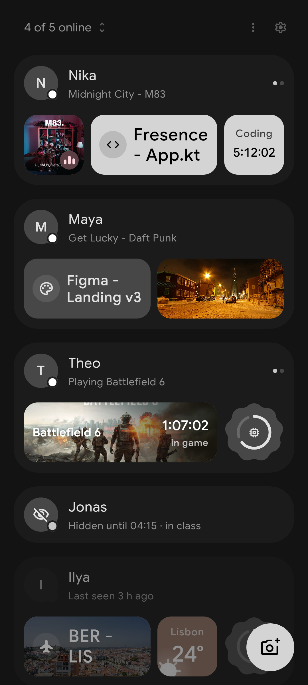
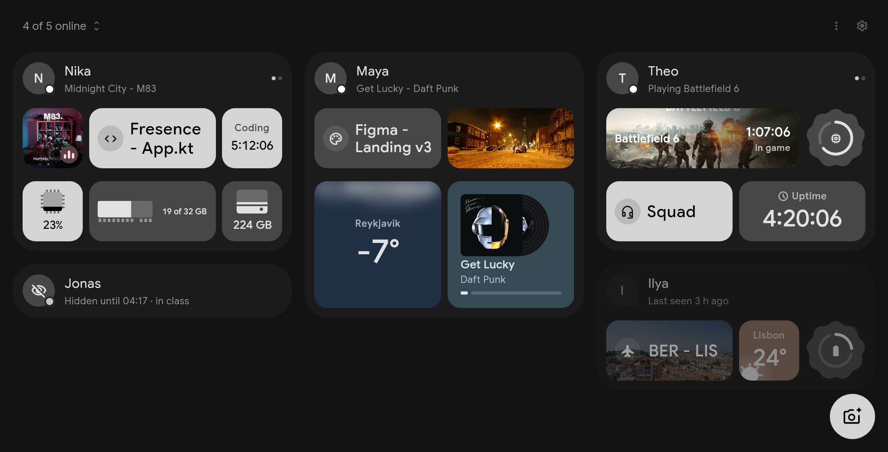

# Fresence

A presence thing I made for a few friends: who's online, what's open on their screen, what they're listening to, which game they're in. Phone and desktop, one small server that can't read any of it.

Started as "I want a Discord-style status bar without Discord". Every device gets a card made of tiles (focused app, track, Steam game, weather, clock, chess.com rating, photo, short video clip, any value from a shell command), and you lay your own card out on a grid. Incognito hides a device from the room until you turn it off or its timer runs out.

<p>
  
  
</p>



Everything that describes you (cards, state, photos, clips) is end-to-end encrypted. The server stores and forwards blobs, and sees who's in which room and when a device is online, but not what's on it.

## Install and join

Everything is on [Releases](https://github.com/Berupor/Fresence/releases). You can only get in with an invite from someone already in a room (see below). Open the invite link, scan its QR in the app, or paste it.

- Android: `fresence-android.apk`. Allow installing from your browser when it asks. The app updates itself from Releases.
- Windows: `fresence-windows-amd64-setup.exe`. Installs the desktop app and the agent that collects your status, per user, no admin rights. Both update themselves.
- Linux: one command installs the agent as a `systemd --user` service (`fresence.service`) and, on x86_64, the desktop app:

  ```bash
  curl -fsSL https://raw.githubusercontent.com/Berupor/Fresence/master/agent/packaging/install.sh | bash
  ```

  The app is unpacked to `~/.local/share/fresence/desktop`, started with `fresence-desktop` from `~/.local/bin` (or from the app menu), and registered as the `fresence://` handler. On aarch64 you get only the agent. The agent updates itself and the app along with it, a running app picks the new build up on the next start.

The Linux agent has a CLI if you don't want the app:

```bash
fresence join 'https://fresence.ug3n.com/j#...'   # or a fresence://... string
fresence status
fresence watch
```

`fresence watch` prints the room as JSON lines. There is also a Quickshell bar widget for it in [ii-widget-fresence](https://github.com/Berupor/ii-widget-fresence).

Other commands: `fresence incognito on --for 2h --note "back later"`, `fresence incognito off`, `fresence photo pic.jpg --ttl 6h`, `fresence set <id> [text]` for a manual value from your config, `fresence update`.

## Invites and other devices

Anyone who is an admin of a room makes an invite in the app or with `fresence invite` (`--room` picks the room if you have several). It shows a QR in the terminal and a link under it. One invite lets in one person and works for 7 days. Whoever uses it creates their account on the spot. The finishing step happens on an admin's device, so if all of them are offline it completes when one comes back.

The link looks like `https://fresence.ug3n.com/j#...`. It opens a small page that hands the invite to the app (Android opens the app directly) or offers a download if there's no app yet. A raw `fresence://...` string works everywhere the link does.

Rooms have admins who can invite, kick and promote: `fresence room list`, `room create`, `room leave`, `room kick`, `room promote`, `room demote`.

A second device joins your account instead of making a new one. On a device that's already in, run `fresence link` and scan or paste the offer on the new one with `fresence link <offer>`. Or the other way round: `fresence link --server https://fresence.ug3n.com` on the new device shows an offer for the old one. An offer lives 10 minutes. `fresence device list` and `fresence device revoke <device>` manage the list. There's no password and no recovery: lose every device and you start a new account, so link at least two.

## Bugs

Bugs and requests go to [Issues](https://github.com/Berupor/Fresence/issues).
